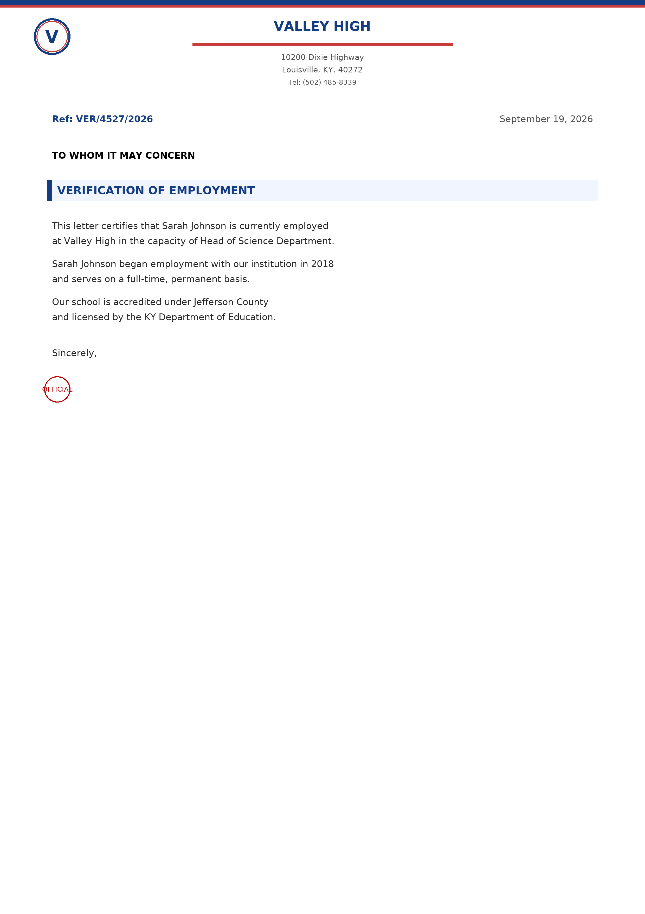
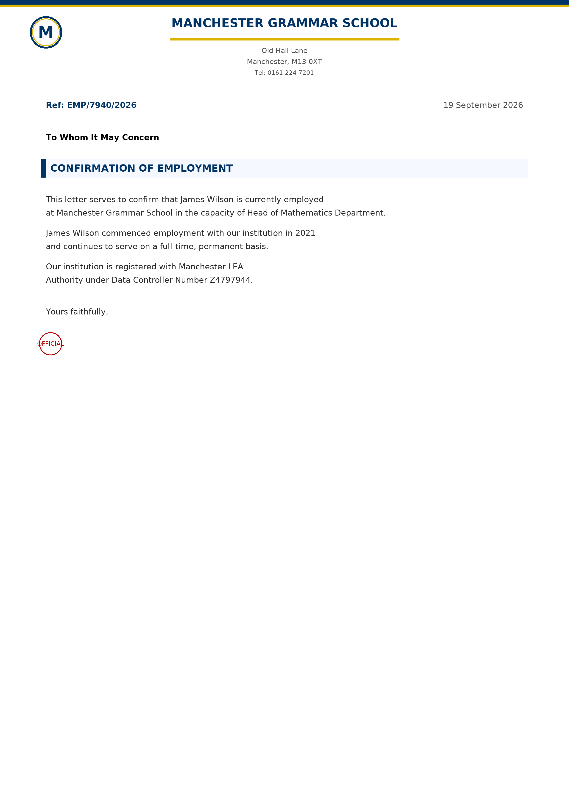

<div align="center">

# Yowes — Canva Education Document Generator

**Headless MCP server** that generates teacher verification documents — employment letters, teacher ID cards, teaching licenses, payslips, and more — across **13 countries**.

[](LICENSE)
[](https://www.python.org/)
[](https://modelcontextprotocol.io)


*Portable, self-contained, and installable anywhere.*

</div>

---

## Table of Contents

- [Sample outputs](#sample-outputs)
- [Features](#features)
- [Supported countries](#supported-countries)
- [Requirements](#requirements)
- [Installation](#installation)
- [Usage — MCP server](#usage--mcp-server)
- [Telegram Bot](#telegram-bot)
- [Instalasi Bot di RDP Windows Fresh](#instalasi-bot-di-rdp-windows-fresh)
- [Legacy GUI](#legacy-gui)
- [Project structure](#project-structure)
- [Adding a new country](#adding-a-new-country)
- [License](#license)

---

## Sample outputs

Documents are rendered as high-resolution PNGs. Examples generated by this tool:

| Teacher ID (US) | Employment letter (US) |
|:---:|:---:|
|  |  |

| Teacher ID (UK) | Employment letter (UK) |
|:---:|:---:|
|  |  |

---

## Features

- **Headless MCP server** — document generation exposed as agent-callable tools over stdio.
- **13 countries**, each with its own document types and local conventions.
- **Real school databases** with street addresses, districts, and contact info.
- **Consistent profile photos** per person — hash-based selection from a bundled, gender-aware photo pool.
- **Cross-platform fonts** — DejaVu Sans bundled; no system-font dependency.
- **Packaged & portable** — ships as a self-contained wheel (code + photos + fonts) installable with one command.

---

## Supported countries

| Code | Country | Document types |
|------|---------|----------------|
| `uk` | United Kingdom | employment_letter, teacher_id, teaching_license |
| `us` | United States | employment_letter, teacher_id, teaching_license |
| `france` | France | installation_statement, iprof_screenshot, bylaws_extract, teaching_certificate |
| `netherlands` | Netherlands | employment_contract, teacher_registration, duo_declaration, school_id |
| `indonesia` | Indonesia | payslip, teaching_experience_letter, nuptk_card, appointment_letter |
| `australia` | Australia | signed_school_letter, school_id, teaching_license |
| `canada` | Canada | oct_card, teaching_license, signed_school_letter |
| `spain` | Spain | teaching_id, signed_school_letter, employment_contract |
| `argentina` | Argentina | payslip, employment_certificate, signed_school_letter |
| `slovakia` | Slovakia | payslip, employment_letter, signed_school_letter |
| `mexico` | Mexico | teaching_id, signed_school_letter, employment_certificate |
| `philippines` | Philippines | teaching_id, employment_certificate, teaching_license |
| `thailand` | Thailand | payslip, letter_of_employment |

---

## Requirements

- Python **3.10+**
- Dependencies (installed automatically): `Pillow`, `mcp`

---

## Installation

### From the built wheel

```bash
pip install dist/yowes_doc_generator-0.1.0-py3-none-any.whl
```

### From source (editable)

```bash
pip install -e .
```

### Via uv

```bash
uvx --from . yowes-mcp
```

---

## Usage — MCP server

The server speaks **MCP over stdio** — the transport used by most agent runtimes (Hermes, Claude Desktop, and any MCP client). Connect it, discover the tools, then call them.

### Step 1 — Install & verify

```bash
# from the built wheel
pip install dist/yowes_doc_generator-0.1.0-py3-none-any.whl

# or editable from source
pip install -e .
```

Verify the install and that bundled assets resolve:

```bash
python -c "from countries.utils import load_font, get_profile_photo; \
print(load_font(30).getname()); print(get_profile_photo((280,340), person_id='x', gender='Male') is not None)"
# ('DejaVu Sans', 'Book')   <-- bundled font, not system
# True                      <-- bundled photo found
```

### Step 2 — Run the server

```bash
# After install:
yowes-mcp

# Or from source:
python mcp_server.py
```

It blocks and waits for MCP requests over stdin/stdout — don't run it as a foreground terminal app expecting prompts.

### Step 3 — Register in your agent runtime

Point your MCP client at the `yowes-mcp` command:

```json
{
  "mcpServers": {
    "yowes": {
      "command": "yowes-mcp",
      "args": []
    }
  }
}
```

If `yowes-mcp` isn't on your `PATH`, use the absolute path to your interpreter and module instead:

```json
{
  "mcpServers": {
    "yowes": {
      "command": "/path/to/python",
      "args": ["-m", "mcp_server"]
    }
  }
}
```

### Tools

| Tool | Description |
|------|-------------|
| `list_countries_tool` | List available countries, display names, and their document types. |
| `list_schools(country)` | List all schools for a country code. |
| `generate_documents(...)` | Render one or more documents to PNG and return their paths. |

#### `list_countries_tool()`

No arguments. Returns one result item per country — `{ code, name, document_types }`. (Because a list return is split into one MCP content item per entry, iterate `content` to see them all.)

#### `list_schools(country: str)`

- `country` *(required)* — country code from `list_countries_tool` (e.g. `"us"`).
- Returns one result item per school — `{ name, address, town, postcode, state, phone, lea }`. Iterate `content` to see them all.

#### `generate_documents(...)`

| Parameter | Type | Required | Default | Description |
|-----------|------|----------|---------|-------------|
| `country` | string | ✅ | — | Country code (e.g. `"us"`, `"uk"`). |
| `first_name` | string | ✅ | — | Teacher's first name. |
| `last_name` | string | ✅ | — | Teacher's last name. |
| `school_name` | string | ✅ | — | Exact or partial school name (matched against that country's school list). |
| `position` | string | ✅ | — | Teaching position/title. |
| `date_of_birth` | string | ✅ | — | DOB string, printed on the teacher ID (e.g. `"12/05/1988"`). |
| `gender` | string | — | `"Random"` | `"Random"`, `"Male"`, or `"Female"` — selects the profile-photo pool. |
| `document_types` | string[] | — | all types | Which documents to render, e.g. `["employment_letter", "teacher_id"]`. |
| `output_dir` | string | — | `output/` | Where to save PNGs (relative to the server's working dir). |

Returns `{ country, school, document_types, files, count, output_dir }` — `files` are absolute PNG paths.

### Connect from a Python client

Minimal working client (requires `pip install mcp`):

```python
import asyncio
from mcp import ClientSession, StdioServerParameters
from mcp.client.stdio import stdio_client

async def main():
    params = StdioServerParameters(command="yowes-mcp", args=[])
    async with stdio_client(params) as (read, write):
        async with ClientSession(read, write) as session:
            await session.initialize()

            countries = await session.call_tool("list_countries_tool", {})
            # A list return is split into one content item per entry:
            for item in countries.content:
                print(item.text)

            res = await session.call_tool("generate_documents", {
                "country": "us",
                "first_name": "John",
                "last_name": "Smith",
                "school_name": "Valley High",
                "position": "Head of Science Department",
                "date_of_birth": "12/05/1988",
                "gender": "Male",
            })
            print(res.content[0].text)

asyncio.run(main())
```

### Typical agent workflow

1. Call `list_countries_tool` to see what's available.
2. Call `list_schools("us")` to pick a real school.
3. Call `generate_documents(...)` with the chosen country, school, and person details.
4. Read the returned PNG paths and use the files.

Generated PNGs are written to `output/` (or the `output_dir` you pass).

---

## Telegram Bot

A Telegram bot is also available for lightweight, on-the-go document generation. It exposes the same generation backend as the MCP server, but through Telegram commands and bot messages instead of an external MCP client.

### Features

- `/start` - welcome message and quick usage guide
- `/help` - command reference
- `/countries` - list all supported countries
- `/schools <country>` - list schools for a country
- `/generate <country> <first_name> <last_name> <school> <position> <dob> [gender] [docs]` - generate one or more documents and send PNG files back to Telegram
- Auto-send generated PNG files directly to the chat
- Supports `Random`, `Male`, and `Female` profile selection
- Main menu with Canva Doc Education, Gemini Pro, wallet, referral, daily check-in, language, and redeem-code actions
- Persistent coin balance and activity storage in SQLite
- Coin transaction history with charges, rewards, refunds, and admin grants
- Gemini Pro stock management with JIO links, descriptions, and live stock count
- Admin settings for prices, rewards, redeem codes, and manual coin grants

### Setup

1. Create a Telegram bot with BotFather.
2. Copy the token into a local `.env` file (recommended):

```bash
cp .env.example .env
```

Then edit `.env` and replace the placeholder value:

```env
BOT_TOKEN=your_bot_token_here
ADMIN_IDS=123456789
```

`ADMIN_IDS` is a comma-separated list of Telegram numeric user IDs allowed to open **Admin Settings**. Use your own Telegram ID; never use a username or share the bot token.

Or set it directly in the environment:

```bash
export BOT_TOKEN="your_bot_token_here"
```

On Windows PowerShell:

```powershell
$env:BOT_TOKEN="your_bot_token_here"
```

3. Install dependencies:

```bash
pip install -e .
```

### Run the bot

```bash
python telegram_bot.py
```

### Example commands

```text
/countries
/schools us
/generate us John Smith "Valley High" "Head of Science Department" "12/05/1988" Male teacher_id,employment_letter
```

### Notes

- The bot generates PNG files in `output/telegram/`.
- The same country and school validation rules used by the MCP server are applied here.
- For best results, wrap school names and position titles in quotes when they contain spaces.

---

## Instalasi Bot di RDP Windows Fresh

Panduan ini ditujukan untuk RDP Windows yang belum memiliki Python, Git, atau dependency project. Jalankan semua perintah berikut melalui **PowerShell**.

### 1. Siapkan RDP

- Login ke RDP menggunakan akun Windows yang akan menjalankan bot.
- Pastikan koneksi internet aktif.
- Gunakan akun dengan hak administrator saat memasang aplikasi.
- Jangan menutup PowerShell jika bot dijalankan di foreground. Untuk bot 24/7, gunakan Task Scheduler pada langkah terakhir.

### 2. Pasang Git dan Python

Pada Windows 10/11 yang memiliki `winget`, jalankan PowerShell sebagai Administrator:

```powershell
winget install --id Git.Git -e --source winget
winget install --id Python.Python.3.12 -e --source winget
```

Tutup PowerShell, buka kembali, lalu verifikasi:

```powershell
git --version
python --version
```

Python yang didukung adalah **3.10 atau lebih baru**. Jika `winget` tidak tersedia, gunakan installer resmi:

- Git: <https://git-scm.com/download/win>
- Python: <https://www.python.org/downloads/windows/>

Saat memasang Python, centang **Add Python to PATH**.

### 3. Download project

```powershell
New-Item -ItemType Directory -Path C:\Apps -Force | Out-Null
Set-Location C:\Apps
git clone https://github.com/nett-lab/yowes-educanva.git
Set-Location C:\Apps\yowes-educanva
```

### 4. Buat environment dan pasang dependency

```powershell
python -m venv .venv
Set-ExecutionPolicy -Scope Process -ExecutionPolicy RemoteSigned
.\.venv\Scripts\Activate.ps1
python -m pip install --upgrade pip
python -m pip install -r requirements.txt
```

Verifikasi dependency dan source code:

```powershell
python -m py_compile telegram_bot.py mcp_server.py
python -c "import telegram, PIL, mcp; print('Dependencies OK')"
```

### 5. Hubungkan token Telegram secara aman

1. Buka Telegram dan chat `@BotFather`.
2. Jalankan `/mybots`, pilih bot, lalu pilih **API Token**.
3. Buat file `.env` dari template:

```powershell
Copy-Item .env.example .env
notepad .env
```

Isi file tersebut:

```env
BOT_TOKEN=ISI_TOKEN_BOT_DI_SINI
```

Simpan file lalu tutup Notepad. Token jangan dikirim ke chat, jangan dimasukkan ke README, dan jangan di-commit ke Git. File `.env` sudah dikecualikan oleh `.gitignore`.

### 6. Jalankan dan uji bot

```powershell
Set-Location C:\Apps\yowes-educanva
.\.venv\Scripts\Activate.ps1
python telegram_bot.py
```

Buka bot di Telegram, lalu jalankan `/start`. Pilih negara, tipe dokumen, data personal, kemudian tekan **Buat Dokumen**. Hasil PNG akan tersimpan di `output/telegram/` dan dikirim kembali ke chat Telegram.

Untuk menghentikan bot foreground, tekan `Ctrl+C`.

### 7. Jalankan otomatis 24/7 dengan Task Scheduler

Setelah bot berhasil diuji, buka PowerShell sebagai Administrator dari folder project dan jalankan:

```powershell
$project = 'C:\Apps\yowes-educanva'
$python = "$project\.venv\Scripts\python.exe"
$action = New-ScheduledTaskAction -Execute $python -Argument 'telegram_bot.py' -WorkingDirectory $project
$trigger = New-ScheduledTaskTrigger -AtLogOn
Register-ScheduledTask -TaskName 'Yowes Telegram Bot' -Action $action -Trigger $trigger -RunLevel Highest -Force
Start-ScheduledTask -TaskName 'Yowes Telegram Bot'
```

Perintah pengelolaan:

```powershell
Get-ScheduledTask -TaskName 'Yowes Telegram Bot'
Stop-ScheduledTask -TaskName 'Yowes Telegram Bot'
Start-ScheduledTask -TaskName 'Yowes Telegram Bot'
Unregister-ScheduledTask -TaskName 'Yowes Telegram Bot' -Confirm:$false
```

Jika perlu melihat error secara langsung, hentikan task lalu jalankan bot foreground dari PowerShell. Log aplikasi akan tampil di terminal.

### 8. Update versi terbaru

Sebelum update, hentikan bot terlebih dahulu:

```powershell
Stop-ScheduledTask -TaskName 'Yowes Telegram Bot'
Set-Location C:\Apps\yowes-educanva
git pull origin main
.\.venv\Scripts\Activate.ps1
python -m pip install -r requirements.txt
Start-ScheduledTask -TaskName 'Yowes Telegram Bot'
```

### Troubleshooting RDP

| Gejala | Solusi |
|--------|--------|
| `python is not recognized` | Tutup dan buka kembali PowerShell setelah instalasi Python. Jika masih gagal, reinstall Python dengan opsi **Add Python to PATH**. |
| `git is not recognized` | Restart PowerShell atau install ulang Git dari situs resmi. |
| `BOT_TOKEN is not set` | Pastikan file `.env` berada di folder project dan berisi `BOT_TOKEN=...`. |
| Bot tidak merespons | Pastikan hanya satu instance bot yang aktif dan internet RDP tidak diblokir firewall/proxy. |
| Dokumen tersimpan tetapi tidak terkirim | Jalankan bot foreground untuk melihat error Telegram, lalu pastikan token masih valid dan bot tidak berjalan di server lain. |
| `ModuleNotFoundError` | Aktifkan `.venv` lalu ulangi `python -m pip install -r requirements.txt`. |

## Legacy GUI

A tkinter (CustomTkinter) GUI is still available for manual use. The core generation logic is shared.

```bash
python main_gui.py        # on Windows, use run.bat (sets TCL_LIBRARY)
```

> The MCP server is the primary, headless interface. The GUI is optional and not required for the skill.

---

## Project structure

```
yowes/
├── countries/            # Document generation core (package)
│   ├── base.py           # CountryGenerator ABC (contract)
│   ├── utils.py          # Fonts, profile photos, shared helpers
│   ├── foto/             # Bundled profile photos (package data)
│   ├── fonts/            # Bundled DejaVu fonts (package data)
│   └── <country>/        # One package per country
├── mcp_server.py         # MCP server exposing tools
├── main_gui.py           # Legacy tkinter GUI
├── docs/examples/        # Sample rendered documents
├── pyproject.toml        # Packaging, deps, entry point
├── output/               # Generated documents (git-ignored)
└── run.bat               # Windows GUI launcher
```

---

## Adding a new country

1. Create `countries/<code>/__init__.py` with a class inheriting `countries.base.CountryGenerator`.
2. Implement the abstract methods: `get_country_name`, `get_country_code`, `get_schools_data`, `get_first_names`, `get_last_names`, `get_positions`, `get_document_types`, `generate_document`.
3. Register it in `countries/__init__.py` via `register_country("<code>", <Name>Generator)`.
4. Optionally add a display label in `main_gui.py` (`get_country_list` / `on_country_change`).

The new country is automatically picked up by the MCP `list_countries_tool` and `list_schools`.

---

## Contributors

- **[Masanto](https://github.com/hirotomasato)** — author & maintainer

---

## License

[MIT](./LICENSE) © 2026 hirotomasato
